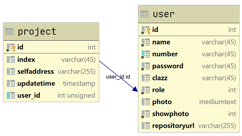

# web-project-manager
为学生课设作业提供，上传war包后自动部署在Tomcat服务器的平台  
部署环境：Docker tomcat:10-jre21 + MySQL:8.4  
简单的数据表结构  
  

[maven打war包配置视频](https://mooc1-1.chaoxing.com/nodedetailcontroller/visitnodedetail?courseId=91374545&knowledgeId=387250418)

基于jquery/ajax/bootstrap/servlet/jstl模拟单页面组件化开发实现，无事务，无容器    
照片尺寸较小，上传后在服务器端按base64编码保存在数据库  
页面通过xlsx库读取选课名单表格，后端引入jackson反序列化  
嗯啊嗯啊，上一次使用这套技术栈写实际项目是2015年，转眼5年了，还好头发没秃。。。  

### Update
#### 2025.05.15
更新到java21；添加导入模板。

#### 2024.05.12
解决浏览器y轴滚动条占用内容宽度。

#### 2024.05.08
仅重新上传war包也更新数据库。

#### 2024.05.07
更新引入最新xlsx库的使用方法。  
还创建使用模板导入。  
使用`<jsp:useBean>`标签声明引入对象时，`type`属性声明，如果对象不存在则抛出异常。
`class`属性声明，不存在则创建对象，但不能声明接口类型。

#### 2022.12.29
更新到jakarta EE+Tomcat10

#### 2021.11.10
添加修改提交时间功能  

#### 2021.11.04
增加应用启动时，读取数据库初始化脚本文件并执行，实现数据库/数据表的自动创建，以及管理员账号的初始化  
将外联至学生个人服务器网址，使用单独图标描述以鼓励  

#### 2021.09.29
在客户端本地完成照片base64编码，提交到数据库后同时更新缓存    
不再直接加载全部照片，改为悬浮时异步加载，减少首屏数据量  
本地缓存已加载过的照片数据  
添加删除部署数据功能  

#### 2021.09.22
截止时间数据不再单建表  
简化照片显式  

#### 2021.01.02
修复y轴滚动条影响宽度  
给学生的数据源默认配置5个初始连接，100多学生直接就是500多连接。下次授课配置为1个连接  
修改MySQL容器连接数上限至1500  
添加截止时间。关闭登录入口，登录中的请求返回登录页面  

#### 2020.12.15
查询数据量远大于写入，简单实现一个首页table数据的缓存。但系统瓶颈在5M网络带宽，不是数据库  
添加响应式布局，小于md，将左胶囊导航转为上导航横向平均排列    
tomcat容器内使用UTC时区，设置启动容器时统一Tomcat/MySQL时区环境变量Asia/Shanghai  